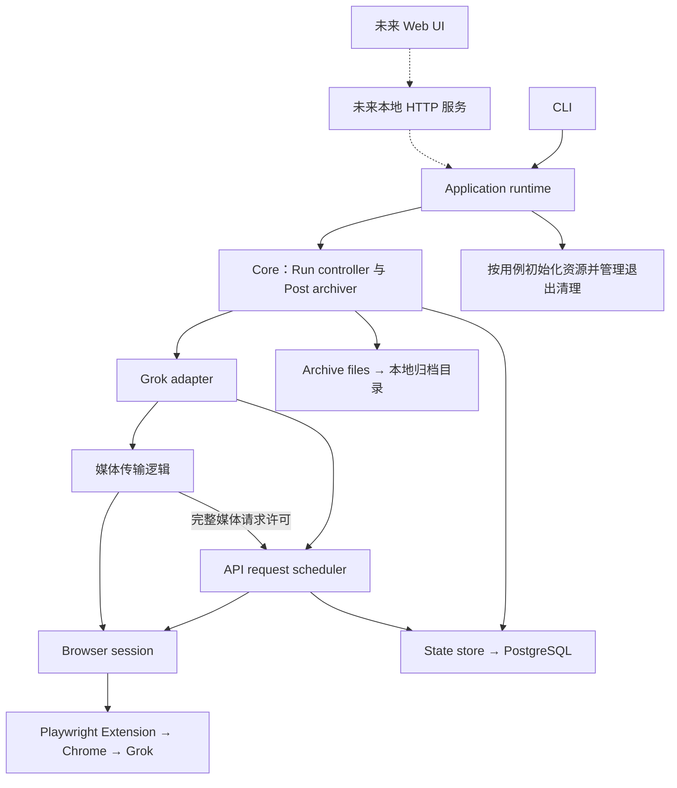
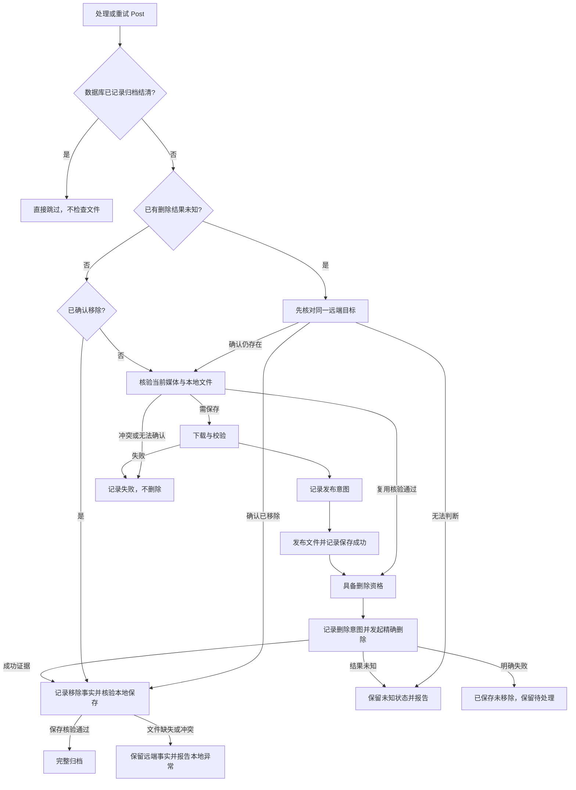

# 架构设计

状态：已确认的架构基线。确认日期：2026-09-25。

本文定义为实现[产品目标与首版范围](docs/specs/product-goals.md)所采用的模块职责和关键决定，不表示这些能力已经实现。一期具体行为、接口、持久字段及验收以[一期可靠保存规格](docs/specs/phase1-saving.md)为权威正文；二期归档、删除恢复与验收以[二期单 Post 完整归档规格](docs/specs/phase2-archiving.md)为权威正文；设计、实现或验证三期连续批量调度、汇总与完成判定时，须读取[三期批量归档规格](docs/specs/phase3-batch-archiving.md)。本文维护模块职责与跨期契约。

## 整体结构

采用 TypeScript 和 Bun，在单个应用进程内按模块组织。归档采用单执行器，串行处理 Post。以目录划分职责，按实际需要增加接口，不预建多服务、多 package 或通用依赖注入框架。

应用分为入口层、归档核心层和外部能力层。独立的 Application runtime 负责组装和资源生命周期。



图中表示主要调用关系。媒体传输逻辑可作为 Grok adapter 的内部实现，不要求独立 package；API 与媒体请求都必须遵守 Core 的停止及全局阻挡决定。

## 入口与应用生命周期

### CLI

负责解析命令和配置、调用应用用例、展示结构化状态及结果，将用户停止操作和进程退出信号转成应用停止请求。

CLI 不创建和管理具体数据库、浏览器资源，不直接修改工作状态，也不判断下载复用或删除资格。

### Application runtime

负责组装 Core 和外部能力模块，按当前用例需要初始化资源，管理唯一执行器的启动、停止和退出清理，向入口提供检查、归档、恢复和状态查询等能力。

首版由 CLI 入口启动前台应用进程，Application runtime 在进程内管理执行器。关闭进程后归档不继续；异常退出后，用户显式启动恢复，程序先核对未完成事实，再继续工作。不引入后台自动重启或常驻服务。

未来增加 Web UI 时，由本地 HTTP 服务调用同一套 Application runtime，网页展示状态并发送控制请求。服务入口增加 HTTP 和服务生命周期接入，复用资源初始化及业务收尾能力。若届时保留 CLI 控制入口，CLI 连接该服务，避免启动第二个执行器。

### 一期目录与用例接口

采用以下最小目录组织，按实现需要增加目录内文件，不预建空实现：

```text
src/
  cli.ts          参数解析、文本展示、退出码和信号接入
  config.ts       按用例读取并校验配置
  application.ts  应用用例、资源组装和生命周期
  core/           Run controller、Post archiver
  grok/           协议解析、共享请求调度、媒体传输
  browser/        浏览器连接、自建页面、请求取消
  store/          PostgreSQL、短事务和执行器锁
  files/          临时写入、核验、发布和文件清理
```

Application 提供与检查、保存、重试、状态和核验命令对应的用例，接受停止信号，通过一个回调报告阶段进度，返回结构化结果。结果区分业务结果、持久事实是否已记录和资源清理错误；CLI 负责终端呈现及退出码映射。Core 通过普通 TypeScript 接口使用外部能力，不接触 Playwright 对象、原始协议响应或 SQL 客户端，不建立事件总线或通用 DI 框架。

二期结果分别表达工作完成、本次远端观察、持久记账确定性及清理错误，远端成功不等于归档已结清。Run 摘要按工作目标区分完成、已结清跳过与未完成情况；`status` 只报告数据库事实，`verify` 优先核验删除依据绑定版本且不改写终态。当前 CLI 和 Application 已实现这些结果区分；完整行为见[二期规格](docs/specs/phase2-archiving.md#application-结果与终端呈现)。

指定 Post、第一页保存和跨 Run `retry` 使用同一个 Post archiver；Run controller 负责选择和顺序安排本次目标。后续连续批量扩展调度，单 Post 删除扩展 Post archiver，不另建保存或恢复路径。

### 按用例启动与失败收尾

Application runtime 按用例获取必要资源，负责写入型执行的 Run 与执行器锁生命周期。只读检查、状态与核验不创建归档工作。资源工厂负责部分初始化清理；runtime 只释放已取得且归属明确的资源，保留业务错误并报告附加清理错误。

一期采用 Bun 内建 `SQL` 与 `playwright-core`，提供显式 `db init`，普通命令不自动建表或迁移。资源矩阵、启动顺序、schema 核对、关闭期限和退出规则见[一期规格](docs/specs/phase1-saving.md#模块和资源生命周期)。

## 归档核心层

| 模块 | 职责 | 不承担的职责 |
| --- | --- | --- |
| Run controller | 新 Run 的启动和停止；安排跨 Run 未完成 Post 的重试；读取第一页、顺序安排 Post、轮间等待与结束判定 | 下载、文件发布和单 Post 删除恢复细节 |
| Post archiver | 确认当前媒体、选择版本、判断下载或复用；组织校验与发布；判断删除资格；处理删除结果及中断恢复 | Grok 原始响应解析、浏览器操作、SQL 实现 |
| API request scheduler | 业务 API 与完整媒体请求共用的串行许可、请求间隔和累计节奏；落实限流、认证阻挡及停止要求 | 媒体传输限速、媒体内部 chunk 调度、Post 完成判定、整个业务操作的自动重试 |

指定 Post 的处理、批量循环和重启恢复复用同一条 Post archiver 路径。Core 返回结构化结果，不依赖终端输出或 HTTP 交互。

Run controller 决定读页等 Run 级操作是否重试；Post archiver 决定单 Post 各阶段是否重试。API request scheduler 判断业务 API 与完整媒体请求何时允许发出。外部模块返回结果，不隐藏业务重试或后续删除。

停止和全局阻挡由 Core 统一协调，API 与媒体传输均不得绕过。一期在途请求收尾以[确认规格](docs/specs/phase1-saving.md#请求传输与停止)为准；删除结果未知按[二期规格](docs/specs/phase2-archiving.md#意图结清与跨-run-顺序)处理。

## 外部能力层

| 模块 | 职责 | 不承担的职责 |
| --- | --- | --- |
| Grok adapter | 构造列表、详情、媒体、精确删除及结果核对请求；校验目标身份；将原始响应转换为项目结果 | 删除资格、工作状态写入、将未知结果推断为成功 |
| Browser session | 封装 Playwright Extension 连接；管理自建标签页；执行浏览器内请求；报告连接故障并清理自建资源 | 归档完成、删除资格和业务重试决策 |
| State store | 保存工作状态与恢复事实，提供必要事务及执行器互斥能力 | 发起 Grok 请求或决定下一业务步骤 |
| Archive files | 临时文件写入、完整性检查、已有文件核验、冲突检测、安全发布和临时资源清理 | 远端删除决策、仅凭文件存在确认保存成功 |

Grok 协议变化集中在 Grok adapter，Playwright 连接变化集中在 Browser session。Core 不依赖原始 JSON 字段或 Playwright 对象。对象身份、下载授权或删除语义改变时，仍可能需要调整核心规则。

连接沿用已验证的 Playwright Extension 方向，具体内部工具入口不是固定契约；依赖版本按仓库工具链规则声明和锁定，升级时验证连接、请求与断开行为。不自行开发浏览器扩展或引入额外 MCP 服务。

## API 节奏与媒体传输

业务 API 与完整媒体请求共用串行许可和请求节奏，媒体内部 chunk 不取许可或额外等待。停止和全局阻挡同时约束 API 与媒体；计数只在本次执行内有效。程序只控制自身请求，不保证控制 Chrome 后台请求或避免 Grok 限流。

一期面向 AI 生成图片和常见小视频，沿用单响应流式传输并针对所选响应校验完整性。当前不建设大视频专用队列、调优参数或内存上界保证，不要求大视频、慢写和峰值内存验收。具体随机间隔、超时、重试额度、响应判据、错误分类及取消规则见[一期规格](docs/specs/phase1-saving.md#请求传输与停止)。正式路径不可行时回到设计调整，不自动更换下载路径。

## 持久状态与文件恢复

采用 PostgreSQL 保存工作状态，本地文件系统保存媒体。数据库提供持久事实；使用或恢复文件时仍需核验文件本身，不能仅凭数据库成功记录或文件存在判断安全。

最小持久职责包括 Run、已开始的 Post、选定媒体、传输与发布事实、删除意图及结果；全局阻挡及等待不作为跨 Run 的请求限制。自动重试计数仅保存在内存中，不持久化剩余额度。整页成员和遍历位置仅保留在内存，已开始 Post 的恢复不依赖它再次出现在第一页。

关键处理顺序为：

```text
确认当前媒体 → 下载并校验 → 记录发布意图
→ 发布文件 → 记录保存成功
→ 记录删除意图 → 精确删除 → 记录移除结果
```

文件系统、数据库和 Grok 不属于同一个原子事务。Post archiver 必须处理文件已发布但数据库未提交、文件缺失或冲突，以及 DELETE 可能已执行但没有回执等情况。未知删除结果先核对，再决定下一步，不能把调用异常解释为远端未执行。

二期删除资格沿用本次成功保存所依据的详情快照及正式文件核验，不追逐保存后出现的远端更新；核验至 DELETE 发出期间，要求用户及外部程序不修改相关归档文件。删除意图固定绑定精确 Post 与已核验、已提交的媒体版本；意图提交确定成功、共享许可等待结束后，仍须在发送前检查执行器锁、停止、阻挡及目标绑定。当前归档实现按此顺序处理；具体核验和失败边界见[二期规格](docs/specs/phase2-archiving.md#详情快照与文件核验)。

首版保证 Post 级恢复及已完成文件复用。未完成媒体允许重新下载，不承诺字节级续传。

一期使用内容摘要路径、发布意图与硬链接无覆盖发布。路径、事务顺序、`finalizing` 恢复矩阵及临时文件清理以[一期规格](docs/specs/phase1-saving.md#文件发布与恢复)为正文。正式实现须验证进程中断恢复，不将原语实验当作断电级验收。

## 贯穿实现阶段的契约

### Run、Post 工作与媒体版本

Run 记录一次执行，Post 工作独立保存处理事实，媒体版本对应具体归档文件。每次保存、归档或重试执行创建新 Run，只读命令不创建 Run，不提供按 Run ID 恢复原 Run 的入口。正常批量启动从当前第一页开始；另设显式重试入口，跨历史 Run 扫描所有未完成 Post，包含明确失败、中断遗留、发布待核对和删除结果未知，逐条核对已有事实并继续处理。新 Run 保留原有 Post 工作事实，但不继承上次 Run 的全局阻挡或冷却状态。同一 Post 同时只由唯一执行器处理。

二期在同一 Post 工作上区分跨 Run 保留的 `save` 与 `archive` 工作目标，重试按各自目标判断是否完成；纯保存结果不自动成为待删除工作。工作目标与删除意图、移除结果分别表达，不建立独立删除任务系统。术语见[领域词汇](CONTEXT.md)，当前实现中的入口、目标提升及恢复集合见[二期规格](docs/specs/phase2-archiving.md#入口与工作目标)。

从一期首次持久处理开始采用这一关系，一期逐条保存第一页，三期增加删除后的连续读页时复用已有 Post 工作。表结构按实际阶段增加，不要求提前创建所有未来字段。

一期的三类最小记录、保存状态、短事务及专用会话锁见[一期规格](docs/specs/phase1-saving.md#持久事实与事务)。后续阶段按实际需要扩展删除事实，不预建历史系统或迁移框架。

### 保存与移除分别记录

| 状态维度 | 需要表达的概念状态 |
| --- | --- |
| 保存 | 尚未保存、正在保存、发布待核对、已安全保存、失败或冲突 |
| 移除 | 尚未发起、结果待确认、已确认移除、失败待处理 |

这些是概念状态，不规定具体枚举或 SQL 字段。保存完成不等于归档完成；只有安全保存并确认移除，才算完整归档。



图示为主流程，具体响应证据在实现规格中确定。数据库已记录归档结清的 Post 再次出现时直接跳过，不访问文件系统。其他中间态 Post 需要核对并继续处理；DELETE 结果未知时先核对远端结果，不盲目重发删除。已确认的远端移除事实不因本地文件异常而抹去。普通状态查询以数据库记录为准，文件事后移动不自动改变已记录结果；显式核验单独报告本次文件检查结果。

二期以独立的归档结清事实明确上述终态，不把历史 `saved` 与新确认的移除事实直接组合成已完成。跨 Run 遇到未结清删除意图统一先核对同一目标；已确认移除但未结清时，只接续绑定版本在当前目录的保存核验与必要补救，允许从保留来源重新获取严格匹配原版本的缺失文件，不再选择新媒体或 DELETE。删除相关写入失回执即停止，后续依据实际持久事实恢复。当前状态及短事务实现见[二期规格](docs/specs/phase2-archiving.md#最小持久事实与完成条件)。

二期将请求失败与远端移除结果分别表达：认可的精确 DELETE 成功响应可直接确认移除，未知结果通过同目标查询核对；错误响应本身不证明副作用未发生。初次处理和跨 Run 恢复要求用户使用同一 Grok 账号，运行期间不切换账号；程序不验证稳定账号身份，不增加账号健康探测。成功、仍存在、未知及认证上下文的具体判据见[二期规格](docs/specs/phase2-archiving.md#正常成功判据)。当前关联实验证据支持继续单 Post 边界；不因潜在关联风险阻塞自动化交付，若后续人工操作发现删除损害其他 Post 主体媒体可获取性的实际证据，再建立具体修复或决策任务并重新讨论范围。

### 媒体身份与本地归档

保存结果绑定精确 Post 身份和媒体内容标识。只有当前 Post 的完整媒体能够唯一确定时才处理；缺失或歧义记录失败，不猜测版本。

一期按每个 Post 一份主体媒体的已验证形状处理，详情身份必须与目标 Post ID 一致；关联 Post、生成输入、封面和缩略图不额外保存，也不能替代缺失的主体媒体。图片沿用 Grok 网页的主体下载选择，视频优先选择已经存在的最高画质；不主动生成或增强，已知最高候选下载失败时不降级。无法识别的结构或无法唯一确定的主体媒体记录该 Post 失败。字段选择与精确判据见[一期规格](docs/specs/phase1-saving.md#post-身份媒体选择与复用)，协议依据见[现场研究报告](docs/research/post-identity-quality.md)。

终态跳过规则优先于媒体核验：数据库已记录归档结清的 Post 直接跳过，不因再次扫描或手工启动处理而检查文件或重新打开工作。`retry` 仅选择未完成工作；显式 `verify` 可以检查文件，但只报告本次核验结果，不改写终态或自动修复。

接续未完成 Post 时，来源信息未变化、已知媒体元数据无冲突，且当前目录中的文件存在、大小与 SHA-256 均符合保存记录，才允许直接复用。此约定不检测服务端在相同来源标识和相关元数据下原地替换字节的情况，不要求每次重新下载远端文件。

来源信息变化时重新下载并校验，不把地址变化直接视为内容变化。以该 Post 已取得的文件内容摘要区分媒体版本：新内容与已有版本 SHA-256 相同，核验已有文件后复用；摘要不同则另存版本，保留旧文件，不覆盖。Post ID 标识归属，下载地址用于获取媒体，二者不充当不可变内容版本号。

数据库与归档目录独立配置，不建立固定绑定。文件定位始终基于本次配置的归档目录及 Post、媒体版本对应的文件身份，采用上述 Post ID 与内容摘要路径。更换目录后，未完成 Post 的核验与复用只检查新目录；找不到文件则尝试重新下载，不搜索旧目录。文件冲突不覆盖；远端媒体已不可获取时报告未完成，不推断恢复成功。必要来源和完整性信息保存在 PostgreSQL，首版不额外维护 sidecar 元数据。完整归档资产由媒体目录和数据库共同组成。

### 停止、阻挡与重试

| 结果类别 | 处理方向 |
| --- | --- |
| 单 Post 失败 | 保留未完成结果，批量运行继续处理其他 Post |
| 全局阻挡 | 停止本次执行的新远端请求，清楚展示阻挡原因 |
| 用户停止 | 不再安排新工作或批准新请求，收尾当前操作并保存事实 |
| 无法自动判断 | 保留未知或待人工状态，不推断成功 |

认证失效和明确的限流响应作为全局阻挡，媒体端点的明确限流同样适用。本次 Run 遇到阻挡即停止并展示原因及服务端提供的等待信息；下一次 Run 直接开始，若再次遇到阻挡则再次停止。不持久化用于请求许可的阻挡或冷却截止时间，不增加解锁或探测解除流程。普通媒体访问错误需按证据分类，单个 `403` 不足以认定整个账号认证失效。

首版以停止和显式恢复为基础，不另设独立暂停状态。停止时结束可中断的媒体传输并保存必要事实；已发出的 DELETE 尽量完成结果收集，无法确定则记录未知，随后释放执行器和自建资源。等待中也应及时响应停止。显式重试扫描数据库中的未完成 Post；正常批量启动从当前第一页开始，遇到中间态 Post 时接续处理。

一期的取消目标、两次 Ctrl+C、关闭期限及清理失败规则见[一期规格](docs/specs/phase1-saving.md#模块和资源生命周期)。

二期每 Post 每 Run 最多发起一次 DELETE，未知结果只做有限同目标核对；本次 DELETE 后确认仍存在，本 Run 不再次删除。首次停止禁止新请求，已发 DELETE 只在原请求期限内收集响应；丢锁或无法确认锁有效后不再修改 Post 工作事实，不自动重连或重新取锁接续。共享许可、核对预算、请求期限及故障收尾的具体契约见[二期规格](docs/specs/phase2-archiving.md#delete-额度与本-run-核对)。

自动重试在每次执行内有界，计数只保存在内存。重新启动、显式恢复或人工重试可获得新的有限额度；不假定重启必然经过足够时间。一期 API 与媒体分别遵守一期规格中的固定预算，共用随机请求间隔；二期 DELETE 与核对遵循[二期规格](docs/specs/phase2-archiving.md#同目标-get-预算与共享许可)的固定预算。

| 信息 | 跨重启处理 |
| --- | --- |
| 普通操作已重试次数、剩余自动额度 | 不保留，每次执行重新计算 |
| 文件发布意图和保存结果 | 保留，用于核对和恢复 |
| DELETE 意图、未知结果和已确认移除 | 保留，未知结果先核对再决定是否重试 |
| 全局阻挡、限流等待 | 只约束当前 Run；新 Run 不继承请求限制 |

人工重试不绕过文件冲突或删除结果未知；当前 Run 新遇到的全局阻挡仍须立即停止。上述持久事实服务于恢复，不要求持久化累计 DELETE 次数或自动重试额度。

### 一期单页保存与跨 Run 重试

一期读取 Saved 第一页，逐 Post 保存后结束；指定 Post 保存与跨 Run 重试复用同一处理路径。保存成功是一期完成条件，不因尚未实现删除而进入重试集合。重试选择、再次保存及未开始项的处理见[一期规格](docs/specs/phase1-saving.md#命令与结果)。

### 批量循环与结果

三期 `archive saved` 从当前第一页启动，每轮固定一次合法读取的成员，按规范化 Post ID 去重且每 Run 只安排一次完整处理。复用同一 Run、锁、连接、scheduler 与单 Post 请求预算，不预建未开始成员的工作，不先执行历史 retry。普通单条失败继续本轮其他 Post；非空轮只有本轮新确认移除算进展，旧移除事实的本地结清及重现项不算进展。

| 结果 | 条件 |
| --- | --- |
| 完成 | 第一页合法且明确为空，全部 Post 工作均按各自 save/archive 目标完成，且正常收尾成功 |
| 未完成且无进展 | 非空轮没有新确认的移除，停止并报告 |
| 未完成 | 合法空页仍有未结算工作，报告未完成 |
| 停止或阻挡 | 用户停止或发生全局阻挡，保留可恢复状态 |

有进展轮次结束后可取消地固定等待 5 秒，再经共享许可读取当前第一页；无进展不追加探测、不翻页。停止、阻挡和基础故障优先于继续或完成判断。本次去重结果、新确认移除、轮次及列表观察、数据库遗留快照分别表达，未知不补零，不展示全局百分比。具体场景、持久摘要与恢复提示由[三期规格](docs/specs/phase3-batch-archiving.md#implementation-decisions)维护；这是已确认契约，不表示批量入口已实现。

### 关键恢复情形

| 情形 | 恢复要求 |
| --- | --- |
| 下载中断 | 保留 Post 工作，允许重新下载未完成媒体 |
| 文件已发布但数据库未提交成功 | 按发布意图核验文件，符合条件后补记，不盲目覆盖 |
| 已记录保存成功但文件缺失或冲突 | 重新判断保存条件，冲突时报告，不凭旧成功记录发起删除 |
| DELETE 已发出但失去回执 | 先核对同一目标，无法判断时保留未知 |
| 用户停止或发生全局阻挡 | 收尾并保存事实，显式恢复后先核对未完成工作 |
| 新 Run 遇到既有工作 | 复用处理事实和当前目录中已核验的文件；自动重试额度重新计算，不继承旧 Run 的阻挡 |

### 阶段性入口与验收

一期第一页逐 Post 保存及指定 Post 保存、二期单 Post 归档和三期连续批量处理调用同一套 Application runtime 与 Post archiver，仅限制处理范围或执行阶段。阶段性入口不拥有独立数据库记录体系、下载器或恢复逻辑，不扩展为完整的只保存产品模式。

验收由核心行为、真实本地边界和 Grok 现场证据共同组成。数据库与文件恢复使用真实 PostgreSQL 和临时归档目录；进程中断、执行器互斥和资源清理需有对应边界证据。失回执、崩溃、限流等主要通过受控条件稳定验证。现场核对当前连接、响应和传输；真实删除使用明确授权样本。自动化通过与现场成功各自说明覆盖范围，不能互相替代。

一期自动化与现场证据的覆盖范围、approved seams、门禁和阻断条件统一见[一期规格的 Testing Decisions](docs/specs/phase1-saving.md#testing-decisions)。浏览器自动化仅采用项目接口 mock/fake；真实 DB、文件、进程边界及浏览器现场验收各自提供证据。

二期沿用 S1 Application 与 S2 真实 CLI 观察方式，使用项目浏览器能力 fake 和真实隔离 DB、文件、进程边界。自动化交付不依赖 Chrome、Extension、Grok 登录态、真实删除样本或人工配合；正式现场验收由用户在实现交付后人工操作，独立报告未验证范围，不作为自动化完成的阻塞项。测试基础设施仍需锁定工具链与 Docker，测试自行准备并清理隔离资源。当前候选的完整矩阵核对见[二期交付覆盖核对](docs/research/phase2-acceptance.md)；矩阵、门禁和交接契约见[二期规格](docs/specs/phase2-archiving.md#testing-decisions)。

## 已确认决定与后续细化

当前采用单应用、单执行器、前台 CLI、独立 Application runtime、PostgreSQL 加本地文件、用户显式恢复，以及 API 与完整媒体请求共享节奏的方案。PostgreSQL 带来数据库运行与维护要求，本项目不同时提供 SQLite 等多种存储实现。

三期的自动化验收沿用已批准的 S1/S2，在项目浏览器能力接口模拟有状态远端，DB、文件及进程使用真实隔离边界；代表性多轮覆盖、最终完整门禁及交付后人工验收边界见[三期 Testing Decisions](docs/specs/phase3-batch-archiving.md#testing-decisions)。

各期具体契约分别由[可靠保存规格](docs/specs/phase1-saving.md)、[单 Post 完整归档规格](docs/specs/phase2-archiving.md)和[批量归档规格](docs/specs/phase3-batch-archiving.md)承接。具体函数签名、配置键名与 SQL 定义在实现中沿用已确认语义；正式连接、持锁连接失效、取消及关闭仍须应用路径验证。旧项目的数据、运行任务、表结构和消息协议不自动继承。

实现顺序和阶段验收见[实现路线图](docs/development/implementation-roadmap.md)。具体执行工作以 Beads 为入口并引用本文；架构决定变更时同步更新本文，需要单独保留重要取舍背景时再记录 ADR。
